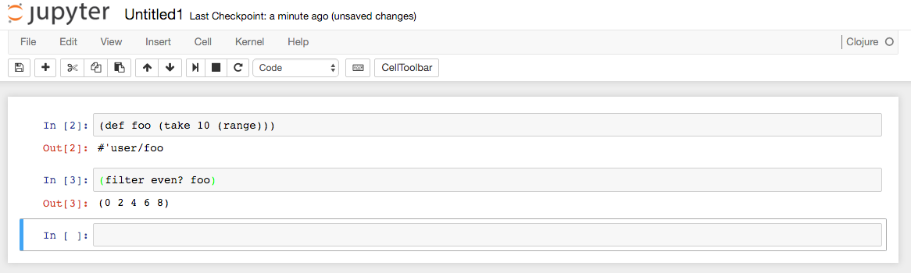
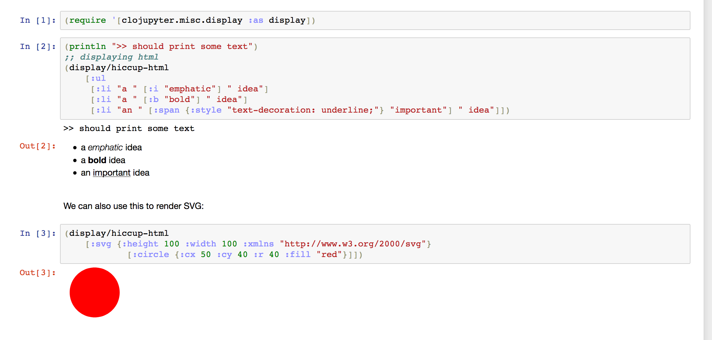

A Jupyter kernel for Clojure - run Clojure code in Jupyter Lab, Notebook and Console.

[](https://clojars.org/clojupyter) 

## Table of Contents

* [Getting Started](#getting-started)
* [Installation](#installation)
  * [Usage Scenarios - check here to see options for using Clojupyter](./doc/usage-scenarios.md)
  * [Using Clojupyter as a library](./doc/library.md)
  * [Clojupyter and Conda](./doc/clojupyter-and-conda.md)
   * [Conda-installing Clojupyter](./doc/conda-installing.md)
* [Command line interface](#command-line-interface)
* [To do](#todo)
* [Collaboration](#collaboration)

##



## Getting Started

In the `examples` folder of the repository are there 3 example notebooks showing some of the
features of clojupyter.  See [this
notebook](https://github.com/clojupyter/clojupyter/blob/master/examples/demo-clojupyter.ipynb)
showing examples of how you can display HTML and use external Javascript:



There are 3 example notebooks because Jupyter offers several distinct
user interfaces - Jupyter Lab, Jupyter Notebook and Jupyter Console -
which have different feature sets for which clojupyter offers
different support. We have one example notebook showing the features
shared by Lab and Notebook and for each showing their distinct
features. According to the Jupyter development roadmaps, Jupyter
Notebook will eventually be phased out and completely replaced by
Jupyter Lab.

You can also use existing JVM charting libraries since you can render any Java BufferedImage.


## Installation

Clojupyter can be used in several ways, please read [Usage Scenarios](doc/usage-scenarios.md) to
find out which type of use model best fits you needs, and how to install Clojupyter in that
scenario.

## Running Jupyter with Clojupyter


#### Jupyter Notebook

To start Jupyter Notebook do:

```bash
jupyter notebook
```

and choose 'New' in the top right corner and select 'Clojure (clojupyter...)' kernel.

#### Jupyter Lab

To start Jupyter Lab do:

```bash
jupyter lab
```

#### Jupyter Console

You can also start the Jupyter Console by:

```bash
jupyter-console --kernel=<clojupyter-kernel-name>
```
Use `jupyter-kernelspec list` to list all available kernels. So e.g. in case of installing clojupyter using conda the start command is:
```bash
jupyter-console --kernel=conda-clojupyter
```

## Command Line Interface

If you are using Clojupyter as a library, you can use Clojupyter's command line interface to perform
operations such as listing, installing, and removing Clojupyter kernels.

For example, in a Clojure repository which includes Clojuputer, you can get the list of available
commands:

```
bash> clj -m clojupyter.cmdline list-commands
Clojupyter v0.2.3 - List commands

    Clojupyter commands:

       - help
       - install
       - list-commands
       - list-installs
       - list-installs-matching
       - remove-installs-matching
       - remove-install
       - version

    You can invoke Clojupyter commands like this:

       clj -m clojupyter.cmdline <command>

    or, if you have set up lein configuration, like this:

       lein clojupyter <command>

    See documentation for details.

exit(0)
```

See [Command Line Interface](doc/command-line.md) for more details.


## TODO

Development progress is based on voluntary efforts so we can't make any promises, but the
wish list for clojupyter development looks something like this:

* [ ] Front-end: Support reindentation, Parinfer, syntax highlighting in code blocks
* [ ] Connect running kernel to running Clojure instances
* [ ] Clarify/simplify external access to rendering - eliminate dependency from Oz to clojupyter
* [ ] Support interactive Jupyter Widgets

Feed-back is welcomed, use the [discussions
page](https://github.com/clojupyter/clojupyter/discussions) to ask questions, give suggestions or just to say hi 👋.

If you have issues with Clojupyter, check the [issues
page](https://github.com/clojupyter/clojupyter/issues) to see if your problem is already reported and open a new issue if needed. 


## Collaboration
If you submit a pull request that ends up getting merged, we will give you commit access.
