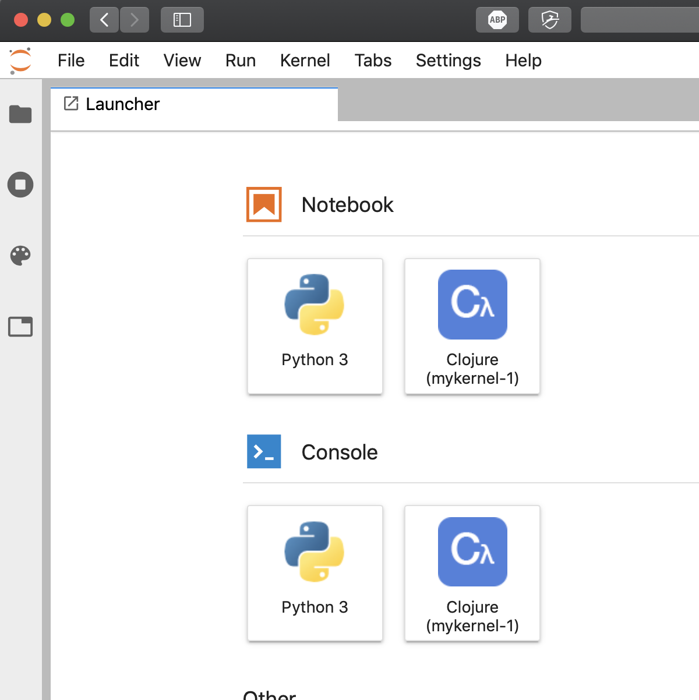
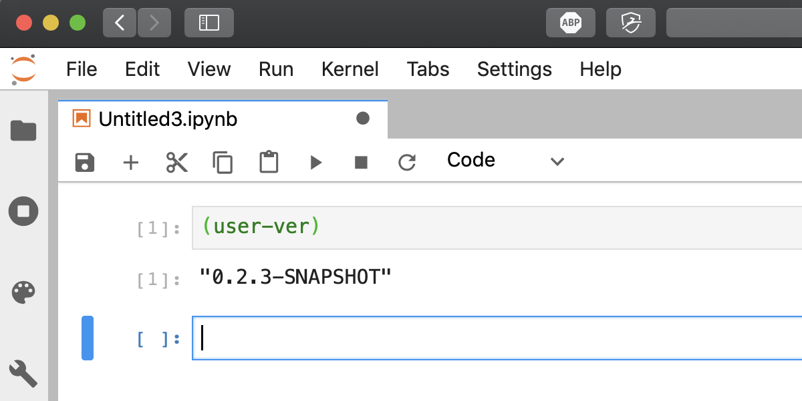
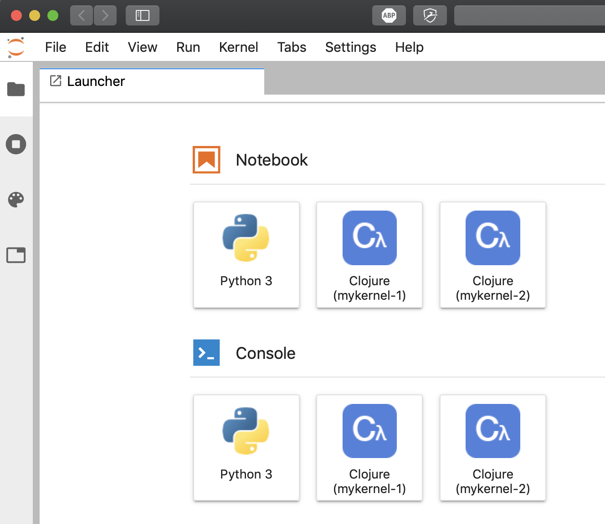
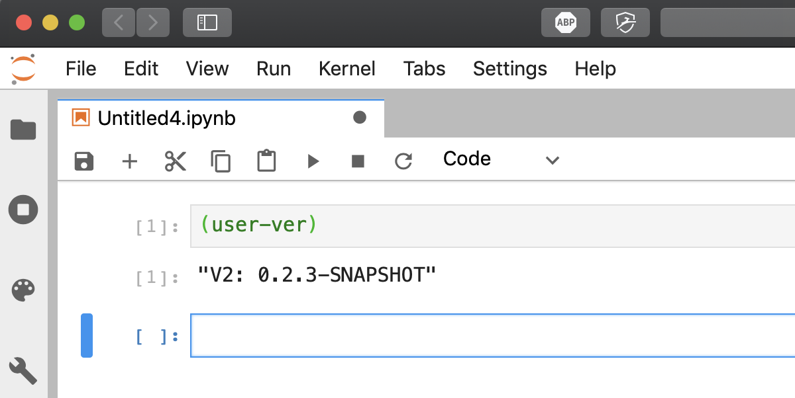

# Using Clojupyter as a library

Clojupyter can be used as a standard Clojure library, when you include it your application gains the
ability to be used as a Jupyter kernel.  Another way to think about it is that you can customize
Clojupyter to include libraries and custom code which will then be available from the beginning of
the Jupyter session rendering thereby avoiding the need to load the libraries in the notebook.

Including Clojupyter in your project also provides Clojupyter's command line interface which is
you'll use to manage the project's kernels.  The following illustrates how this works.  Your
preferred workflow may look differently, hopefully the features provided will fit into that as well.

Let's look at the simplest possible Clojure project, initially with only 2 files:

```
> tree .
.
├── deps.edn
└── src
    └── user.clj

1 directory, 2 files
```

The `deps.edn` file references Clojupyter and `depstar` which we'll see later let's us build an
uberjar:

```
> cat deps.edn
{:deps {clojupyter {:mvn/version "0.2.3-SNAPSHOT"}}
 :aliases {:depstar
           {:extra-deps
            {seancorfield/depstar {:mvn/version "0.3.0"}}}}}
```

In `user.clj` we use a tiny bit of Clojupyter:

```
 > cat src/user.clj
(ns user (:require [clojupyter.kernel.version :as ver]))

(defn user-ver []
  (ver/version-string-long))
```

To ensure we have Clojupyter available in the cache - which let's start using Clojupyter's cmdline
interface - we start by generating an uberjar using `depstar`:

```
> clojure -A:depstar -m hf.depstar.uberjar clojupyter-standalone.jar
Building uber jar: clojupyter-standalone.jar
{:warning "clashing jar item", :path "META-INF/sisu/javax.inject.Named", :strategy :noop}
{:warning "clashing jar item", :path "META-INF/plexus/components.xml", :strategy :noop}
...more warnings elided...
```

We start by noticing that no Clojupyter kernels are installed currently:

```
 > clj -m clojupyter.cmdline list-installs
Clojupyter v0.2.3-SNAPSHOT - All Clojupyter kernels

    No kernels match ''.

exit(1)
```

So now that we have an uberjar

```
 > tree
.
├── clojupyter-standalone.jar
├── deps.edn
└── src
    └── user.clj

1 directory, 3 files
```

Let's install it with a custom name:

```
 > clj -m clojupyter.cmdline install --ident mykernel-1 --jarfile clojupyter-standalone.jar
Clojupyter v0.2.3-SNAPSHOT - Install local

    Installed jar:	clojupyter-standalone.jar
    Install directory:	~/Library/Jupyter/kernels/mykernel-1
    Kernel identifier:	mykernel-1

    Installation successful.

exit(0)
```

and check using `list-installs`:

```
 > clj -m clojupyter.cmdline list-installs
Clojupyter v0.2.3-SNAPSHOT - All Clojupyter kernels

    |      IDENT |                                  DIR |
    |------------+--------------------------------------|
    | mykernel-1 | ~/Library/Jupyter/kernels/mykernel-1 |

exit(0)
```

If we start Jupyter Lab, we see that the kernel is a available as a Clojupyter kernel named
`mykernel-1`:



If we start the kernel we see that it contains the litte function we defined (cf. `user.clj` above):



If we make a small change to `user.clj`:

```
 > cat src/user.clj
(ns user (:require [clojupyter.kernel.version :as ver]))

(defn user-ver []
  (str "V2: "(ver/version-string-long))) ;; <== CHANGE IN THIS LINE
```

generate a new uberjar:

```
 > clojure -A:depstar -m hf.depstar.uberjar kernel2.jar
Building uber jar: kernel2.jar
{:warning "clashing jar item", :path "META-INF/sisu/javax.inject.Named", :strategy :noop}
...warnings elided...
```

and install this as kernel with a new identifier:

```
> clj -m clojupyter.cmdline install --ident mykernel-2 --jarfile kernel2.jar
Clojupyter v0.2.3-SNAPSHOT - Install local

    Installed jar:	kernel2.jar
    Install directory:	~/Library/Jupyter/kernels/mykernel-2
    Kernel identifier:	mykernel-2

    Installation successful.

exit(0)
```

we now have a new kernel installed:

```
> clj -m clojupyter.cmdline list-installs
Clojupyter v0.2.3-SNAPSHOT - All Clojupyter kernels

    |      IDENT |                                  DIR |
    |------------+--------------------------------------|
    | mykernel-1 | ~/Library/Jupyter/kernels/mykernel-1 |
    | mykernel-2 | ~/Library/Jupyter/kernels/mykernel-2 |

exit(0)
```

which shows up in Jupyter Lab:



and behaves differently than the first edition of the kernel:



Let's leave the system like we found it by removing the kernels:

```
 > clj -m clojupyter.cmdline remove-installs-matching 'mykernel-[12]'
Clojupyter v0.2.3-SNAPSHOT - Remove installs

    Step: Delete /Users/klaush/Library/Jupyter/kernels/mykernel-1
    Step: Delete /Users/klaush/Library/Jupyter/kernels/mykernel-2

    Status: Removals successfully completed.

exit(0)
```

which leaves us without any Clojupyter kernels:

```
 > clj -m clojupyter.cmdline list-installs
Clojupyter v0.2.3-SNAPSHOT - All Clojupyter kernels

    No kernels match ''.

exit(1)
```

